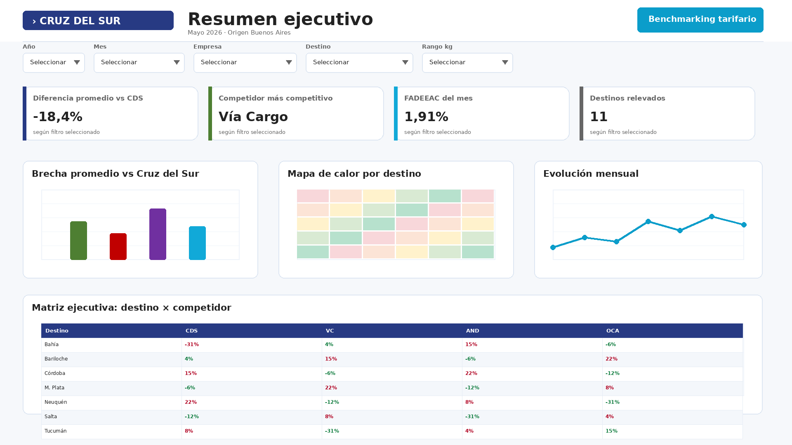
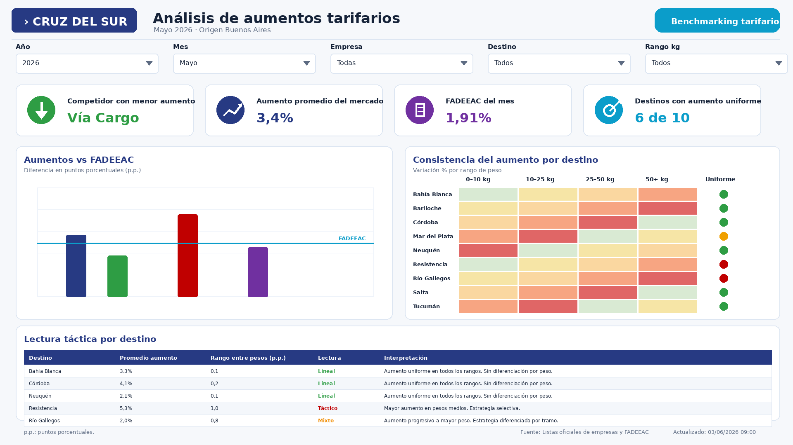

# Benchmarking tarifario logístico

## Resumen del proyecto

Proyecto de automatización y análisis de benchmarking tarifario para operadores logísticos. El objetivo fue transformar un relevamiento manual de precios de mercado en un proceso sistemático, trazable y preparado para análisis mensual.

La solución permite relevar tarifas de distintos competidores, normalizar la información por destino, peso y tipo de servicio, construir una base histórica y visualizar los resultados en reportes ejecutivos y dashboards interactivos.

## Problema

El proceso de comparación tarifaria se realizaba de forma manual: una persona consultaba sitios web, descargaba tarifarios, copiaba precios, armaba planillas y generaba comparativos. Esto implicaba mucho tiempo operativo, riesgo de errores y baja trazabilidad histórica.

## Solución desarrollada

Se diseñó un flujo automatizado para:

* Relevar precios online de competidores.
* Procesar tarifas publicadas en PDF.
* Consolidar información propia y de mercado.
* Normalizar datos por destino, peso, empresa y mes.
* Generar comparativas mensuales.
* Crear una base histórica compatible con Power BI.
* Elaborar reportes ejecutivos y dashboards interactivos.

## Componentes del proyecto

### 1. Automatización de recolección de datos

Se desarrollaron scripts en Python para consultar cotizadores online y procesar tarifarios publicados. El flujo permite obtener precios por destino y rango de peso de manera repetible.

### 2. Normalización y consolidación

Los datos obtenidos se integran en una estructura común, permitiendo comparar empresas con criterios homogéneos: destino, peso, tipo de servicio, mes y fuente del dato.

### 3. Base histórica

Se construyó una base acumulable para Power BI, preparada para analizar la evolución mensual de precios, aumentos por empresa, desvíos frente a referencias de costos y comportamiento por rango de peso.

### 4. Reporte ejecutivo

Se generó un reporte mensual orientado a dirección, con resumen de hallazgos, contexto de costos y comparativa competitiva.

### 5. Dashboard Power BI

Se diseñó un tablero interactivo con dos vistas principales:

* **Resumen ejecutivo:** posición competitiva mensual, brecha frente a competidores, presión por destino y matriz de comparación.
* **Análisis de aumentos:** evolución de aumentos, comparación contra FADEEAC y detección de estrategias lineales o tácticas por destino y rango de peso.

## Tecnologías utilizadas

* Python
* Pandas
* Playwright
* OpenPyXL
* Power BI
* Excel
* Automatización de reportes
* Procesamiento de archivos PDF
* Modelado de datos para análisis histórico

## Valor generado

El proyecto permitió convertir una tarea operativa y manual en una solución automatizada de inteligencia comercial. Entre los principales beneficios:

* Reducción del tiempo de relevamiento.
* Menor riesgo de errores manuales.
* Trazabilidad de precios por mes.
* Base histórica reutilizable.
* Dashboard interactivo para toma de decisiones.
* Identificación de presión competitiva por destino y rango de kilos.
* Comparación de aumentos contra referencias de costos como FADEEAC.

## Capturas del dashboard

### Resumen ejecutivo



### Análisis de aumentos tarifarios



## Estructura del repositorio

```text
benchmarking-tarifario-logistica/
│
├── src/
│   ├── cotizar_andreani_lote.py
│   ├── cotizar_viacargo_lote.py
│   ├── generar_comparativa_precios.py
│   ├── generar_input_viacargo_desde_excel.py
│   ├── generar_oca_resultados.py
│   └── generar_reporte_word.py
│
├── dashboard/
│   ├── 01_resumen_ejecutivo.png
│   └── 02_analisis_aumentos_tarifarios_template.png
│
├── docs/
│
└── README.md
```

## Nota sobre los datos

Por confidencialidad, este repositorio no incluye archivos comerciales reales, tarifas internas, bases históricas completas ni modelos Power BI con datos sensibles. Las capturas y scripts se presentan como muestra del enfoque técnico y metodológico aplicado.
